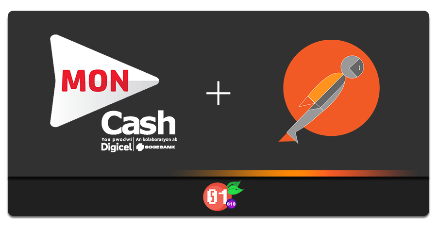

`Version 1.0.0`

[en]: ./README.md "English translation"

[fr]: ./README.md "Traduction française"

[ht]: ./README.md "TRadiksyon kreyòl"

🌎 i18n:  [`🇺🇸`][en] • [🇫🇷][fr] • [🇭🇹][ht]

# Postman

This is a Postman API similar to the [the official one](https://documenter.getpostman.com/view/1199944/UVeJKju3)
provided in
the portal documentation, with additional features:

### ✨ Merchant + Client endpoints
Both end points and their requests are handled.

### ✨ Environment

Set the environment variables to easily switch between `live` and `sandbox`, or securely share your business API
endpoints with co-developers.

### ✨ Automatic Authentication Bearer

Every request that need will automatically fetch a new authentication token and re-use it it is not expired yet.

### ✨ Share state between requests
Some values are automatically saved to be shared for the next API call in the payment flow.

> Example:
> 
> the `Create Payment` call from the client endpoints automatically  reserves the `payment_token.token` for the `Payment/Redirect` request.
> If you leave the `token` parameter empty it will use the last saved token.

### ✨ RSA Base64 encryption
For the Client button (_Client2: *_) requests the request body is automatically encrypted. Only make sur to set the 

Enjoy!

## How to use

Fork the [API](https://www.postman.com/fruitsbytes/workspace/fruitsbytes/api/c5cf75e5-32be-4296-bf15-f312b7cea489) and 
set the environment variables. You can use the `MonCash - Sandbox` environment  as a guide.

  

(learn
   more [here](https://medium.com/apis-with-valentine/demystifying-postman-variables-how-and-when-to-use-different-variable-scopes-66ad8dc11200)
   and [here](https://learning.postman.com/docs/sending-requests/variables/) ).

### More on how to manage Postman collection

- Official
  documentation: [Importing and exporting data](https://learning.postman.com/docs/getting-started/importing-and-exporting-data/)
    - [Importing from GitHub repositories](https://learning.postman.com/docs/getting-started/importing-and-exporting-data/#importing-from-github-repositories)
- Videos:

| Title                                         | Link                                                                                                                                      |
|-----------------------------------------------|-------------------------------------------------------------------------------------------------------------------------------------------|
| How to use and share Postman Collections      |  |
| How to Share Postman Collections              |  |
| Postman How to Connect to Your Git Repository |  |
| Generate a Collection From a Specification    |  |    
       
     

