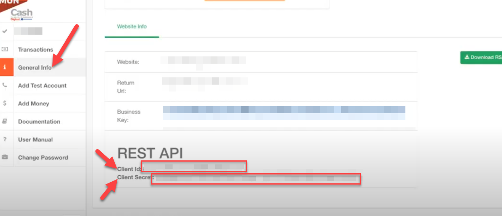

<p align="center">


[](https://packagist.org/packages/fruitsbytes/php-moncash) 
[](https://packagist.org/packages/fruitsbytes/php-moncash) 
[](https://packagist.org/packages/fruitsbytes/php-moncash) 
[](https://packagist.org/packages/fruitsbytes/php-moncash) 
[](https://packagist.org/packages/fruitsbytes/php-moncash)
[](https://packagist.org/packages/fruitsbytes/php-moncash)

<p>
<small> <b>*</b> The Digicel&trade;, MonCash&trade;, Sogebank&trade; and all other trademarks, logos and brand names are the property
of their respective owners. All company, product and service names used in this documentation are for identification purposes
only. Use of these names,trademarks and brands does not imply endorsement. </small>
</p>

<p>
<small>
<a href="https://www.digicelgroup.com/ht/en/moncash/business.html" target="_blank">MonCash&trade;</a>
 is a mobile money service provided by 
<a href="https://www.digicelgroup.com/" target="_blank">Digicel&trade;</a> 
that allows daily transactions between MonCash users, regardless of their location in Haiti. 
Digicel is a pioneer in mobile money. Their financial services  are currently expanding into other markets, specifically in the pacific island with MyCash&trade;
[<a target="_blank" href="https://mycash.com.fj/" >1</a>] [<a target="_blank" href="https://mycash.ws/" >2</a>] 
</small>
</p>

Digicel Moncash PHP library
=============

[en]: ./README.md "English translation"

[fr]: ./README.fr.md "Traduction française"

[ht]: ./README.ht.md "TRadiksyon kreyòl"


🌎 i18n:  [🇺🇸][en] • [🇫🇷][fr] • [🇭🇹][ht]

A library to facilitate Digicel MonCash mobile money integration on your PHP projects via
their [API](https://sandbox.moncashbutton.digicelgroup.com/Moncash-business/resources/doc/RestAPI_MonCash_doc.pdf). It
is part of the MonCash SDK provided by Fruitsbytes.

Other libraries for this SDK:

+ 🚧  [Laravel]() - Package
+ 🚧  [Wordpress]() - Plugin with WooCommerce integration
+ 🚧  [Shopify]() - App
+ 🚧  [JavaScript]() - Support for NodesJs servers and Web clients
+ 🚧  [Angular]() - Configurable Button
+ 🚧  [ReactJS]() - Configurable Button
+ 🚧  [VueJS]() - Configurable Button
+ 🚧  [Capacitor]() - IonicFramework Plugin for Android and IOS with deepLink integration support

<div id="features"></div> 

------------

## Features

- Authentication
- Traffic optimisation (`Advanced`)
- Security: Secret Management (`Advanced`)
- Payment
- Transfer
- Idempotence (`Advanced`)
- HTML button
- Localization (`Advanced`)
- Phone Validation (`Advanced`)

<p>Check the  <a href="/CHANGELOG.md">CHANGELOG</a> for additional information on breaking changes and new features.</p>


<div id="installation"></div> 

------------

## Installation

The preferred way to install this extension with all it's dependencies, is
through [composer](http://getcomposer.org/download/).

### Terminal

You can run the installation composer command from the root of your project:

```shell
composer require fruitsbytes/php-moncash
```

alternatively :

```shell
php composer.phar require --prefer-dist fruitsbytes/php-moncash "*"
```

### Config file

or update your `composer.json` and add the package in the `require` section:

```json
{
  "require": {
    "fruitsbytes/php-moncash": "*"
  }
}

```

Run the installation command

```shell
composer install
```

------------

## Prerequiste

In order to interact with the Digicel's API, you need to the credentials for your buisiness application. You can scope
your business operations with multiple sets of credentials. For example you can have on set for websites and another one
for mobile apps with different redirection urls. This can be very useful to manage `deep links`,

To create and manage your credentials:

1) Go to the [Moncash Sanbox portal](https://sandbox.moncashbutton.digicelgroup.com/Moncash-business/New)
2) Select your business or add a new one (Note the congratulation and return URL for `deep links` and web integration)
3) Retrieve the `clientID` and `clientSecret` to interact with the API
4) Retrieve the `BusinessKey` if you plan on using the Button

<table>
<tr><td>
💥 <small>IMPORTANT security note:</small>
</td>
</tr>
<tr><td>
 <small>Save your business secret in a secure place. Do not share the file containing the secret. Change the secret from time to time.:  </small>

<ul>
<li><small>exclude `.env` from Git commits  </small></li>
<li><small>Use a third party Secret manager /Vault to store the secret, example: GCP Secret Manager</small></li>
</ul>


</td></tr>
</table>

---

## Quick Start

After retrieving the credentials ab installing the package you are ready to start using it.

Make sure the environment variables are set:

```shell
MONCASH_CLIENT_ID="?????"
MONCASH_CLIENT_SECRET="?????"
MONCASH_BUSINESS_KEY="?????"
MONCASH_MODE="sandbox"
MONCASH_LANG="env"
```

For a complete guide please check the [documentation](./docs/en/0_ABOUT.md) or the [code examples](./demo).


-----------

## TODO

- [ ] Version 2.0 migrate to php 8.1 + PhpUnit10 (2023-02-03)
- [ ] Add additional tests
- [ ] Add Additional PhpDoc & [PhpStorm Attributes](https://github.com/JetBrains/phpstorm-attributes)
- [ ] Make a video guide on how to use the library
- [ ] Implement additional Secret Manager
- [ ] Implement additional Token Machine
  - [ ] APC
  - [ ] Flysystem
  - [ ] Memcache
  - [ ] Memcached
  - [ ] MySQL
  - [ ] Redis
- [ ] Implement additional idempotence key maker
  - [ ] MySQL
  - [ ] UUID
- [ ] Add translations
- [ ] Add demos

---

## Contributing

### Test

When modifyiing
To run the test use the following shell command from this directory.

Set the values of `.env.testing` environment file. 

```shell
composer phpunit
```

or

```shell
vendor\bin\phpunit
```

⚠ Refrain from using production credentials for testing.

---

## Other libraries & complementary documentation

Online videos :

- 🇭🇹 [Kijan pou mete Moncash sou sit ou pou w vann](https://youtu.be/lE3ejFT11_w)
- 🇫🇷 [Comment Intégrer l'onglet Moncash Pay à votre commerce online - Technopro Web](https://youtu.be/NiWYrO_E5ik)  (🕊
  Osirus)

<p align="center">
<a href="https://www.digicelgroup.com/ht/en/moncash/business.html" target="_blank">
</a>
</p>

## 🔐 Security

If you discover a security vulnerability within this package, please send an email to [security@anbapyezanman.com](mailto:security@anbapyezanman.com). All security vulnerabilities will be addressed as soon as possible. You may view our full security policy [here](./SECURITY.md).


## ⚖ License

this library is licensed under [The MIT License](LICENSE).


## 🏢 For Enterprise

[Fruitsbytes](fruitsbytes.com) can deliver commercial support and maintenance for your applications. Save time, reduce risk, and improve code health, while paying the maintainers of the exact dependencies you use.

contact us at [inquery@anbapyezanman.com](mailto:inquery@anbapyezanman.com)
