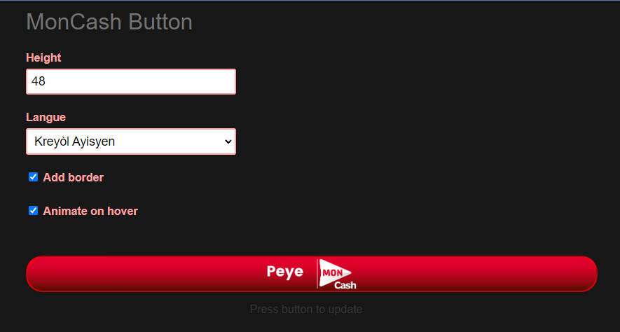

# Moncash

<p>


</p>

[en]: ./README.md "English translation"

[fr]: ./README.fr.md "Traduction française"

[ht]: ./README.ht.md "TRadiksyon kreyòl"


🌎 i18n:  [`🇺🇸`][en] • [🇫🇷][fr] • [🇭🇹][ht]


<p align="center">


</p>

<p align="center">


</p>


A library to facilitate Digicel MonCash mobile money integration on your PHP projects via
their [API](https://sandbox.moncashbutton.digicelgroup.com/Moncash-business/resources/doc/RestAPI_MonCash_doc.pdf). For
now it
handles the <u>base</u> (client) use cae. The <u>merchant</u> use cases wil be available soon. It
is part of the MonCash SDK provided by FruitsBytes.


------------

## [🍇Features](#features)

- [ ] Client side Adapter (Payment, Transfer, ...)
    - [x] Render Button
    - [x] Payment
    - [ ] Transfer
- [x] Traffic optimisation (`Advanced`)
- [x] Security: Secret Management (`Advanced`)
- [x] Unique orderID generator
- [x] Retry (`Advanced`)
- [x] Phone Validation (`Advanced`)
- [ ] Client Button, No Backend (Encrypted, client side button)
- [ ] Merchant App  (Cash-In , Cash-Out, ...)
- [ ] Idempotence (`Advanced`)
- [ ] Localization (`Advanced`)
- [ ] Task (Recurring payments, garbage collector,...)

<p>Check the  <a href="/CHANGELOG.md">CHANGELOG</a> for additional information on breaking changes and new features.</p>


<div id="installation"></div> 

------------

## [🍈Documentation](#Documentation)

For a complete guide please check the [Wiki](https://github.com/Fruitsbytes/php-moncash/wiki) or the [code examples](./demo).


## [🍉Quick Start](Quick Start)

### Installation

```shell
composer require fruitsbytes/php-moncash
```

### Environment variables & configuration
You can setup a .env file in the root of your project to automatically configure the client:

```shell
# .env 

MONCASH_CLIENT_ID="<!your-client-id/>"
MONCASH_CLIENT_SECRET="<!your-client-secret/>"
MONCASH_BUSINESS_KEY="<!--------/>"
MONCASH_MODE="sandbox"
MONCASH_LANG="env"
MONCASH_RSA_KEY_PATH="/secure-path-to-rsa-dir/rsa.txt"
```

```php
// index.php

use Fruitsbytes\PHP\MonCash\API\Client;

$client = new Client();

```

You override the Environment variables or completely ignore them:

```php

use Fruitsbytes\PHP\MonCash\Configuration\Configuration;

$configuration = new Configuration(["lang"=>"ht"]);

```

The default no config value :

```php
// src/Configuration/Configuration.php

 const DEFAULT_CONFIG = [
        'mode'             => 'sandbox',
        'lang'             => 'en',
        'clientSecret'     => '', 
        'clientId'         => '',
        'businessKey'      => '',
        'rsaPath'          => './rsa.text',
        'timeout'          => 60,
        'secretManager'    => DefaultSecretManager::class,
        'tokenMachine'     => FileTokenMachine::class,
        'phoneValidation'  => LibPhoneValidation::class,
        'orderIdGenerator' => UUIDOrderIdGenerator::class,
    ];

```

### Usage

#### Client

For client facing websites and mobile app, where the client iniates the payment.

```php
// Create a payment & redirect user
use Fruitsbytes\PHP\MonCash\API\Order;
use Fruitsbytes\PHP\MonCash\API\PaymentFoundResponse;
use Fruitsbytes\PHP\MonCash\API\PaymentFoundResponse;
use Fruitsbytes\PHP\MonCash\APIException;
use Exception;

try{
   $order = new Order($amount); // if you have your own orderID `new  Order($amount, $uuid)` 
   $payment = $client->createAndRedirect($order);
}catch( APIException $e){ 
   $message = $e->getMessage();
}
catch( Exception $e){ 
   $message = $e->getMessage();
}

// get payment by orderID if ypui do not habe the transation ID yet
/**
* @var PaymentFoundResponse
 */
$payment = $client->getPaymentByOrderId($order->id);

// get payment by transactionID when transaction is finished
$transactionId = $_GET['transactionId']

/**
* @var PaymentFoundResponse
 */
$payment = $client->getPaymentByTransactionId($transactionId);

if(!$payment->isSuccessful()){
  throw new \Exception($payment->message);
}


```

#### Button

The button, when clicked, will create the transaction and redirects the user to the

```php
// Generate Button form html code
use Fruitsbytes\PHP\MonCash\Button\ButtonStyleRedResponsive;

$buttonConfig = [
     true, // border
     'em', //  lang
     true, // animate on  hover,
     48 // height
];
$button = new ButtonStyleRedResponsive( $order, $clientConfig, ...$buttonConfig);

$htmlButton = $button->html();
print($htmlButton);

// or Use the \Stringable interface
print $button;


```

You can render the template directly

```php
$buttonHT = $button( $order, [], true, 'ht');

$buttonHT->render();
```

<div align="center">
 
<p>Button config Playground</p>
</div>

#### Merchant

For applications aimed at store clerks or business owners where the client is present at the time of the transaction. It
handles Cash-In and Cash-Out scenarios.

==== 🚧 Coming soon =====

-----------


## [🍊Playground](#playground)

==== 🚧 Website Coming soon =====

You can check the Postman API [online]() or [import](./Postman) the .json from this repository.


-----------


## [🍍Contribution](#contribution)

All pull requests and suggestions are welcomed. If there is a particular feature you are struggling make a pull reque

## [🍒Test](#test)

When modifyiing
To run the test use the following shell command from this directory.

Set the values of `.env.testing` environment file.

```shell
composer phpunit
```

or

```shell
vendor\bin\phpunit
```

⚠ Reduce credentials being leaked by not using production credentials for testing.

---

## [🍓Other](#Other)

#### FruitsBytes MonCash SDK:

| Repo                                                                       | Description                                                                                                        |                                      Version                                      | Status |
|----------------------------------------------------------------------------|--------------------------------------------------------------------------------------------------------------------|:---------------------------------------------------------------------------------:|:------:|
| [Laravel examples](https://github.com/Fruitsbytes/Laravel-Moncash-Example) | Examples using pure laravel codes, no- external libraries.                                                         |  |   ✅    |
| [Laravel]()                                                                | A fully funtional package for laravel                                                                              |               <b>alpha</b> <br/> <small>not ready to share</small>                |   🚧   |
| [Wordpress](#wordpress)                                                    | Use MonCash on Wordpress sites. Also available for Woocommerce integration                                         |               <b>alpha</b> <br/> <small>not ready to share</small>                |   🚧   |
| [Shopify](#shopify)                                                        | Use MonCash as a shopify payment method                                                                            |               <b>alpha</b> <br/> <small>not ready to share</small>                |   🚧   |
| [NodeJS](#nodeJS)                                                          | Using NodeJS as a server this can be used with idependently or as an API (for non-SSR websites for example).       |               <b>alpha</b> <br/> <small>not ready to share</small>                |   🚧   |
| [Javascript Examples](#javasccript-examples)                               | Repositories with a general idea on how to consume the API with several use case and JS Frameworks native solution |               <b>alpha</b> <br/> <small>not ready to share</small>                |   🚧   |
| [Angular](#angular)                                                        | Configurable Button + Server side compolnents (Angular Universal)                                                  |               <b>alpha</b> <br/> <small>not ready to share</small>                |   🚧   |
| [ReactJS](#reactJS)                                                        | Configurable Button + Server side compolnents (Next.js, )                                                          |               <b>alpha</b> <br/> <small>not ready to share</small>                |   🚧   |
| [VueJS](#vueJS)                                                            | Configurable Button                                                                                                |               <b>alpha</b> <br/> <small>not ready to share</small>                |   🚧   |
| [Capacitor](#capacitor)                                                    | IonicFramework Plugin for Android and IOS with deepLink integration support and extra security                     |               <b>alpha</b> <br/> <small>not ready to share</small>                |   🚧   |

#### MonCash Documentation

- [Client Rest API](https://sandbox.moncashbutton.digicelgroup.com/Moncash-business/resources/doc/RestAPI_MonCash_doc.pdf) (
  client facing user interface)
    - [Button](https://sandbox.moncashbutton.digicelgroup.com/Moncash-business/resources/doc/MC_Button_Doc.pdf)
- [Merchant Rest API](https://documenter.getpostman.com/view/1199944/UVeJKju3) (admin/merchant facing UI)
- Dashboard: [sandbox](https://sandbox.moncashbutton.digicelgroup.com/) (for test)
  | [production](https://moncashbutton.digicelgroup.com/Moncash-business/Login) (live)

#### Offical Repo

- [ecelestin/ ecelestin-Moncash-sdk-php](https://github.com/ecelestin/ecelestin-Moncash-sdk-php/blob/master/src/PaymentMaker.php)
  ✍ ing. Enadyre celeste

#### Online videos :

| Title                                                                                                           | Link                                                                                                   |
|-----------------------------------------------------------------------------------------------------------------|--------------------------------------------------------------------------------------------------------|
| Kijan pou mete Moncash sou sit ou pou w vann (🇭🇹)  <br/> ✍ Certil Rémy                                                   | [](https://www.youtube.com/watch?v=lE3ejFT11_w) |
| Comment Intégrer l'onglet Moncash Pay à votre commerce online - Technopro Web (🇫🇷) <br/> ✍  Osirus Kurt, RIP 🕊 | [](https://www.youtube.com/watch?v=NiWYrO_E5ik) |


--------


## [🍋Security](#security)

If you discover a security vulnerability within this package, please send an email
to [security@anbapyezanman.com](mailto:security@anbapyezanman.com). All security vulnerabilities will be addressed as
soon as possible. You may view our full security policy [here](./SECURITY.md).


--------

## [🍎Need help?](#help)

Don't hesitate to go in the discussion page and check if the issue is not addressed yet. You can start a new discussion
if need be.

If you are an upcoming startup, a student or don't have the budget for consultation fees, it will take longer but we can
submit a public repo illustrating the help you need as long as it will benefit the rest of the community:

Contact us at <a href="mailto:help@anbapyezanman.com" target="_blank">help@anbapyezanman.com</a>

<table>
<tr valign="middle">
<td>
<a href="https://www.youtube.com/channel/UC14dR51q2_mFCQulsmecL1Q" target="_blank">

</a>
</td>
<td >
You can also check our <a href="https://www.youtube.com/channel/UC14dR51q2_mFCQulsmecL1Q" target="_blank">Youtube Channel</a>
</td>
</tr>
</table>

### For Enterprise

[Fruitsbytes](fruitsbytes.com) can deliver commercial support and maintenance for your applications. Save time, reduce
risk, and improve code health, while paying the maintainers of the exact dependencies you use.

Contact us at [business@anbapyezanman.com](mailto:business@anbapyezanman.com)


--------

## [🍏License](#license)

This library is licensed under [The MIT License](LICENSE).

### Discalimer

<p>
<small> <b>*</b> The Digicel&trade;, MonCash&trade;, Sogebank&trade; and all other trademarks, logos and brand names are the property
of their respective owners. All company, product and service names used in this documentation are for identification purposes
only. Use of these names,trademarks and brands does not imply endorsement. </small>
</p>

<p>
<small>
<a href="https://www.digicelgroup.com/ht/en/moncash/business.html" target="_blank">MonCash&trade;</a>
 is a mobile money service provided by 
<a href="https://www.digicelgroup.com/" target="_blank">Digicel&trade;</a> 
that allows daily transactions between MonCash users, regardless of their location in Haiti. 
Digicel is a pioneer in mobile money. Their financial services  are currently expanding into other markets, specifically in the pacific island with MyCash&trade;
[<a target="_blank" href="https://mycash.com.fj/" >1</a>] [<a target="_blank" href="https://mycash.ws/" >2</a>] 
</small>
</p>


